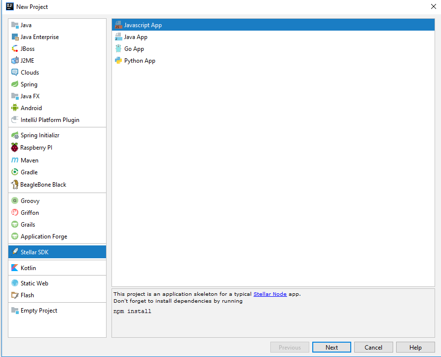
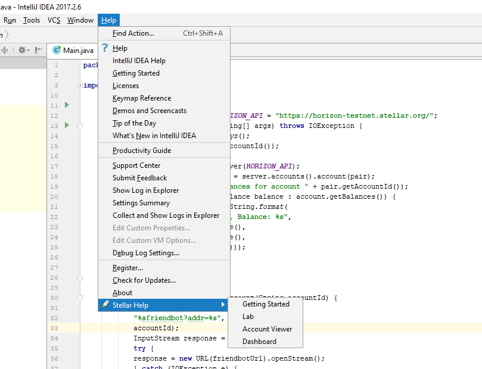
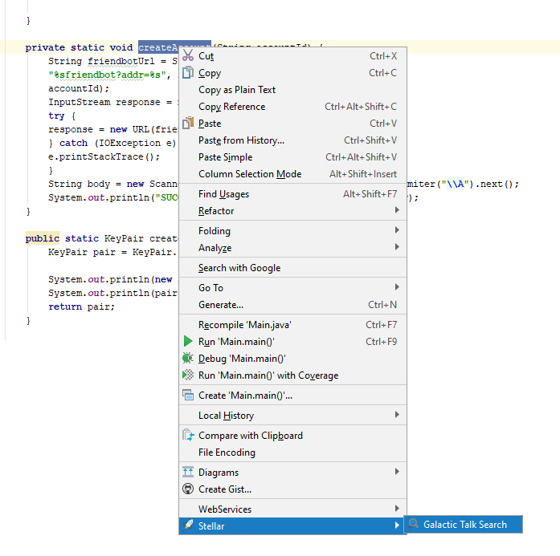
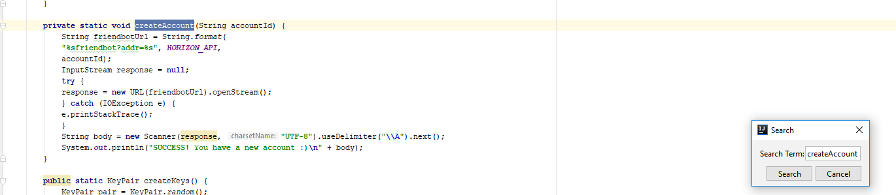
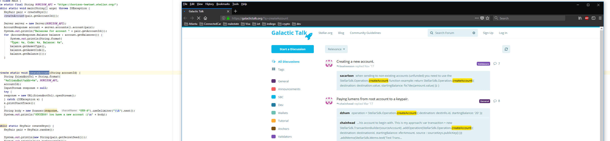

Stellar SDK IntelliJ Plugin   
=============================

[](https://travis-ci.org/asebak/stellar-xlm-intellij-plugin)

```
https://plugins.jetbrains.com/plugin/10432
```

Stellar SDK IntelliJ is a Plugin for IntelliJ IDEA that makes it easier to develop apps on the Stellar platform.

  - Supports Java and Javascript project templates
  - Help Section integrated into the IDE
  - Galactic Talk search queries.


### How To Use

- Create a new project : 



- Find help about the Stellar SDK.



- Search Galactic Talk







### Checking out and Building

Configure your Intellij environment using the following link: https://www.jetbrains.com/idea/help/configuring-intellij-platform-plugin-sdk.html

You can build the project directly from IDEA.  Continous Integration script can be executed using:
```sh
$ sudo sh ./ci-build.sh
```

### External Libraries
* Lombok Project (Install the IntelliJ plugin or project won't compile)
* Freemarker
* IntelliJ SDK 2017 + Java 8 (since release 1.20)

### Development

If you want to contribute and add functionality, make sure to add unit tests if they are needed.

